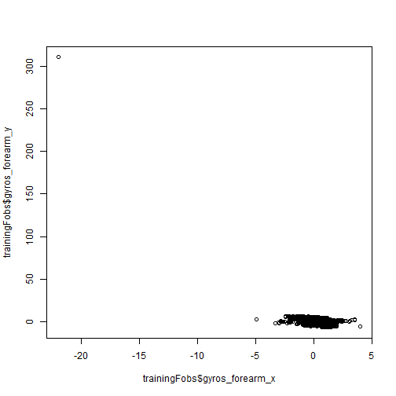
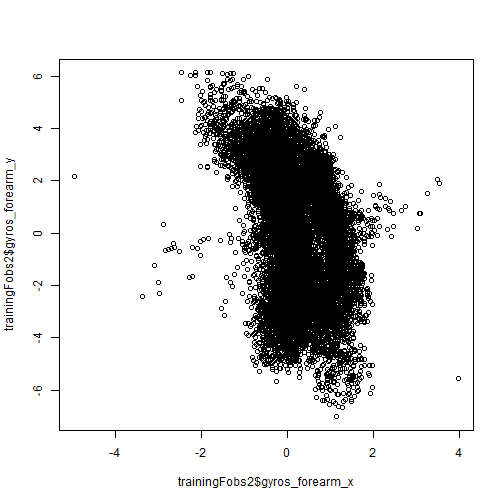

Practical Machine Learning Project
========================================================
# Introduction

We feed a model data points collected during certain types of motions, and then we use this model to predict the motion type for arbitrary observations. In this case, the motions are dumbbell exercises, some with good form, and some not.

# Data Processing

Load the caret library.


```r
library(caret)
```

```
## Loading required package: lattice
## Loading required package: ggplot2
```

Read the testing and training data. Convert the classe factor to an integer vector. This was done because some models don't work with factors, and several models were tried.


```r
testingOrig = read.csv("pml-testing.csv")
trainingOrig = read.csv("pml-training.csv")
training <- trainingOrig
training$classe = as.integer(training$classe)
```

Determine the indices to remove from the raw data. variables with NA's or predominately blanks were removed, as well as variables not directly related to the motion, such as timestamp, or motion performer.


```r
excludeInds <- integer()
for (i in 1:ncol(training)) {
    if (!is.na(summary(training[[i]])["NA's"])) {
        excludeInds <- c(excludeInds, i)
    }
    else if (!is.na(summary(training[[i]])["#DIV/0!"])) {
        excludeInds <- c(excludeInds, i)
    }
}
excludeInds <- c(1:7, excludeInds, 91)
```

Subset the data to exclude those indices.


```r
trainingFobs <- training[,-excludeInds]
```


Create some convenience functions. samplePer will take a sample of the specified sized from each set of motion types, e.g. 100 from each of the five types. missClass will return the percentage of errored predictions.


```r
samplePer <- function(obs, num) {
    counts <- integer()
	lst <- split(obs, obs$classe)
	for (i in 1:length(lst)) {
		counts <- c(counts, nrow(lst[[i]]))
	}
	ends <- cumsum(counts)
	ends <- c(0, ends)
	sampleInds <- integer()
	for (i in 1:(length(ends) - 1)) {
		sampleInds <- c(sampleInds, sample((ends[i]+1):ends[i+1], num))
	}
	sampleInds
}

missClass <- function(values, predictions) {
    sum(round(predictions + 0.01) != values) / length(values)
}
```

# Model Exploration

Several quick models were tried to see what type of performance they would offer, in an exploratory spirit, to provide some patterns and expectations about what types of models would yield well.


Train a glm model.


```r
fit_all_glm_Fobs <- train(classe ~ ., data = trainingFobs, method = "glm")
p_fit_all_glm_Fobs_trFobs <- predict(fit_all_glm_Fobs, trainingFobs)
```

Train an rpart model.


```r
fit_all_rpart_Fobs <- train(classe ~ ., data = trainingFobs, method = "rpart")
```

```
## Warning: There were missing values in resampled performance measures.
```

```r
p_fit_all_rpart_Fobs_trFobs <- predict(fit_all_rpart_Fobs, trainingFobs)
```


Train a random forest against all variables, sampling 100 observations per motion type. The sampling is performed to speed model creation.


```r
fit_all_rf_FobsPer100 <- train(classe ~ ., data = trainingFobs[samplePer(trainingFobs, 100),], method = "rf")
p_fit_all_rf_FobsPer100_trFobs <- predict(fit_all_rf_FobsPer100, trainingFobs)
```


Get the percentage error in classification for these models.


```r
missClass(trainingFobs$classe, p_fit_all_glm_Fobs_trFobs)
```

```
## [1] 0.612
```

```r
missClass(trainingFobs$classe, p_fit_all_rpart_Fobs_trFobs)
```

```
## [1] 0.6544
```


```r
missClass(trainingFobs$classe, p_fit_all_rf_FobsPer100_trFobs)
```

```
## [1] 0.4069
```


At 0.4069 error, the random forest performed best, which was a good indication that it would be worth the time to train a fuller model. Meanwhile, an outlier was discovered during data exploration while waiting for the random forest model.


```r
plot(trainingFobs$gyros_forearm_x, trainingFobs$gyros_forearm_y)
```

 

This value was removed.


```r
max(trainingFobs$gyros_forearm_y)
```

```
## [1] 311
```


```r
trainingFobs2 <- subset(trainingFobs, trainingFobs["gyros_forearm_y"] != 311)
nrow(trainingFobs) - nrow(trainingFobs2)
```

```
## [1] 1
```

Afterwards several plots scaled much better.


```r
plot(trainingFobs2$gyros_forearm_x, trainingFobs2$gyros_forearm_y)
```

 


Another random forest was trained, but this time with twice the sample size per motion type.


```r
fit_all_rf_Fobs2Per200 <- train(classe ~ ., data = trainingFobs2[samplePer(trainingFobs2, 200),], method = "rf")
p_fit_all_rf_Fobs2Per200_trFobs2 <- predict(fit_all_rf_Fobs2Per200, trainingFobs2)
```


```r
missClass(trainingFobs2$classe, p_fit_all_rf_Fobs2Per200_trFobs2)
```

```
## [1] 0.2982
```

```r
x <- 17
```

The error rate noticeably improved, so anther doubling of sample size was performed.


```r
fit_all_rf_Fobs2Per400 <- train(classe ~ ., data = trainingFobs2[samplePer(trainingFobs2, 400),], method = "rf")
p_fit_all_rf_Fobs2Per400_trFobs2 <- predict(fit_all_rf_Fobs2Per400, trainingFobs2)
```


```r
missClass(trainingFobs2$classe, p_fit_all_rf_Fobs2Per400_trFobs2)
```

```
## [1] 0.1792
```

Noticeable improvements again followed. A sample size of 2000 per motion type was then selected to train a random forest model.


```r
fit_all_rf_Fobs2Per2000 <- train(classe ~ ., data = trainingFobs2[samplePer(trainingFobs2, 2000),], method = "rf")
p_fit_all_rf_Fobs2Per2000_trFobs2 <- predict(fit_all_rf_Fobs2Per2000, trainingFobs2)
```


```r
missClass(trainingFobs2$classe, p_fit_all_rf_Fobs2Per2000_trFobs2)
```

```
## [1] 0.0264
```

The resulting error rate was less than 3%. Given time constraints, no further models were created. As the random forest chooses predictors with very good results, there is no need to go into specifics about how the observation variables relate to each other.

Predictions were performed on the test set, and submitted. Notice that the predictions are not integers, and so are rounded to integers.


```r
p_fit_all_rf_Fobs2Per2000_tstOrig <- predict(fit_all_rf_Fobs2Per2000, testingOrig)
p_fit_all_rf_Fobs2Per2000_tstOrig
```

```
##  [1] 2.099 1.243 1.828 1.028 1.281 4.891 3.850 2.387 1.000 1.011 2.138
## [12] 2.916 2.002 1.000 4.876 4.759 1.046 2.236 1.845 2.000
```

```r
asNum <- round(p_fit_all_rf_Fobs2Per2000_tstOrig + 0.01)
asNum
```

```
##  [1] 2 1 2 1 1 5 4 2 1 1 2 3 2 1 5 5 1 2 2 2
```

```r
asLetters <- LETTERS[asNum]
asLetters
```

```
##  [1] "B" "A" "B" "A" "A" "E" "D" "B" "A" "A" "B" "C" "B" "A" "E" "E" "A"
## [18] "B" "B" "B"
```

Upon submission, I achieved 20 out of 20 correct answers, and in that moment I gained a strong appreciation for the actual power of prediction models, that just got a perfect score on data I'd never seen before.

# Error rates

The error rate above of 0.0264 is a form of out of sample error. Whereas the model was created on 2000 samples of each motion type, for a total of 10,000 observations, the error rate of 0.0264 was on a prediction of the entire training set of nearly 20,000 observations. Thus, is it a good approximation of out of sample error.

To give the in sample error, the model was run against the 10,000 observations that created it.


```r
p_fit_all_rf_Fobs2Per2000_trainingData <- predict(fit_all_rf_Fobs2Per2000, fit_all_rf_Fobs2Per2000$trainingData)
missClass(fit_all_rf_Fobs2Per2000$trainingData$.outcome, p_fit_all_rf_Fobs2Per2000_trainingData)
```

```
## [1] 0.0221
```

The in sample error, as expected, is smaller than the estimated out of sample error, being about 83.7% of its size.

Random trees use samples and their out of sample error rates as part of their implementation. This is similar to cross validation, and for use as an estimate of out of sample errors, serves the same purpose. Here we see the results of the samples.


```r
fit_all_rf_Fobs2Per2000$resample
```

```
##      RMSE Rsquared   Resample
## 1  0.2737   0.9677 Resample04
## 2  0.2661   0.9685 Resample09
## 3  0.2805   0.9644 Resample05
## 4  0.2711   0.9676 Resample01
## 5  0.2556   0.9709 Resample10
## 6  0.2635   0.9694 Resample06
## 7  0.2687   0.9678 Resample02
## 8  0.2591   0.9711 Resample11
## 9  0.2605   0.9700 Resample07
## 10 0.2560   0.9707 Resample03
## 11 0.2488   0.9728 Resample12
## 12 0.2530   0.9717 Resample08
## 13 0.2504   0.9719 Resample17
## 14 0.2546   0.9715 Resample13
## 15 0.2571   0.9707 Resample22
## 16 0.2549   0.9713 Resample18
## 17 0.2633   0.9685 Resample14
## 18 0.2516   0.9719 Resample23
## 19 0.2591   0.9704 Resample19
## 20 0.2648   0.9695 Resample15
## 21 0.2660   0.9687 Resample24
## 22 0.2515   0.9723 Resample20
## 23 0.2807   0.9645 Resample16
## 24 0.2520   0.9718 Resample25
## 25 0.2480   0.9721 Resample21
```

The average RMSE among the 25 samples is 0.260424. By looking at the final model, we see that the mean of squared residuals, is 0.04762.


```r
fit_all_rf_Fobs2Per2000$finalModel
```

```
## 
## Call:
##  randomForest(x = x, y = y, mtry = param$mtry) 
##                Type of random forest: regression
##                      Number of trees: 500
## No. of variables tried at each split: 27
## 
##           Mean of squared residuals: 0.04762
##                     % Var explained: 97.62
```

If we take the square root of the mean of squared residuals, we obtain 0.21822 for the final model, which is about 83.8% of the 25 sample average RMSE of 0.260424. In this respect, the random forest's in sample and out of sample relative change compares
